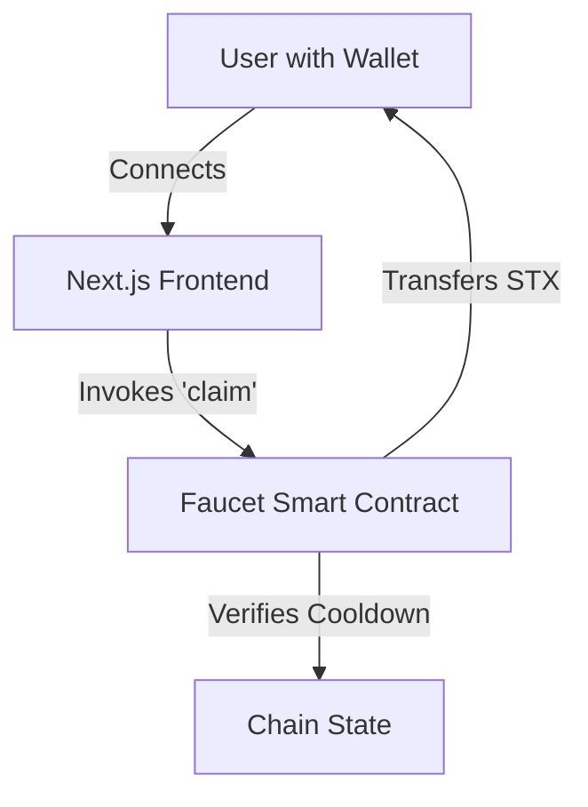

# Stacks Tap

> **Stacks Tap** is a neo-brutalist styled faucet application built on the Stacks blockchain. It allows users to claim 0.01 STX every 24 hours.


---

## 🏗 Architecture

The application follows a decentralized architecture:

- **Smart Contract (Clarinet)**: A Clarity smart contract on the Stacks blockchain manages the faucet logic. It requires no backend server for rate limiting; instead, it uses on-chain storage to track the last claim block height for each principal.
- **Frontend (Next.js)**: A responsive web interface connected to the Stacks wallet. It interacts directly with the smart contract via Stacks.js.



## 🛠 Tech Stack

### Smart Contracts
- **Language**: [Clarity](https://clarity-lang.org/) (Decentralized, predictable smart contracts)
- **Framework**: [Clarinet](https://github.com/hirosystems/clarinet) (Testing and local development)

### Frontend
- **Framework**: [Next.js 16](https://nextjs.org/) (React Framework)
- **Styling**: [Tailwind CSS v4](https://tailwindcss.com/) (Neo-Brutalism Theme)
- **Blockchain Interaction**: [Stacks.js v7](https://github.com/hirosystems/stacks.js)
    - `@stacks/connect`: Wallet authentication
    - `@stacks/network`: Network configuration
- **Package Manager**: pnpm

## 🚀 Getting Started

Follow these steps to set up the project locally.

### Prerequisites
- Node.js (v18+)
- [Clarinet](https://github.com/hirosystems/clarinet) (for contract dev)
- Stacks Wallet (e.g., Leather, Xverse)

### Installation

1.  **Clone the repository**:
    ```bash
    git clone https://github.com/dxfareed/stacks-tap.git
    cd stacks-tap
    ```

2.  **Install Frontend Dependencies**:
    ```bash
    cd frontend
    pnpm install
    ```

3.  **Run the Development Server**:
    ```bash
    pnpm dev
    ```
    Open [http://localhost:3000](http://localhost:3000) in your browser.

> **Note**: This project specifically uses Webpack instead of Turbopack for Stacks.js compatibility. The `dev` command is pre-configured to handle this (`next dev --webpack`).

## 📜 Smart Contract Logic

The `faucet.clar` contract implements a simple cooldown mechanism:

1.  **Constants**:
    - `FAUCET_AMOUNT`: `u10000` (0.01 STX)
    - `COOLDOWN_BLOCKS`: `u144` (~24 hours based on 10min block time)

2.  **Storage**:
    - `ConstantClaims`: A map tracking `principal -> last-claim-height`.

3.  **Validation**:
    - `(asserts! (>= (- current-block last-claim) COOLDOWN_BLOCKS) ...)` ensures the user cannot claim more than once per day.

## 🤝 Contributing

Contributions are welcome! Please feel free to submit a Pull Request.

## 👤 Author

**Fareed**
- Github: [@dxfareed](https://github.com/dxfareed)

## 📚 References

- [Stacks Docs: Get Started](https://www.stacks.co/build/get-started)
- [Clarity Language Reference](https://docs.stacks.co/docs/write-smart-contracts/clarity-language/language-overview)
